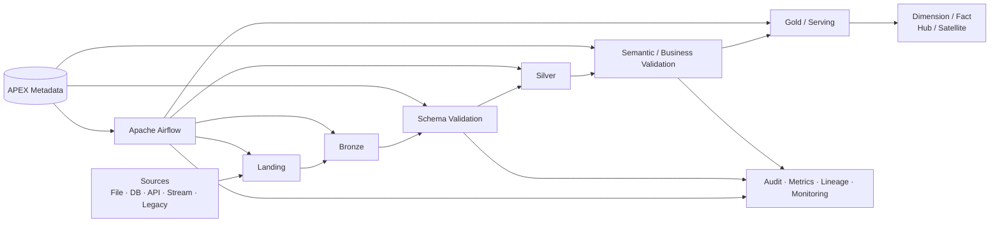
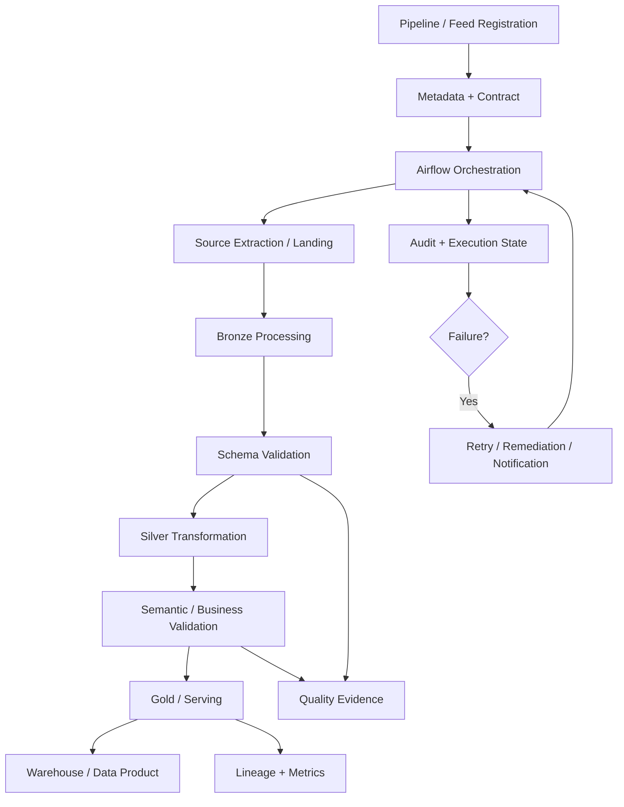

# Enterprise Data Pipelines — APEX Data Engineering Runtime

   

A portfolio implementation of a **metadata-driven enterprise Data Engineering platform** focused on reusable pipeline orchestration, distributed processing, data quality, operational controls, lineage, governance, and production-style delivery.

> Built from a **Lead Data & AI Architect / Principal Data Engineer** perspective. This repository contains implementation artifacts — Airflow DAGs, reusable runtime utilities, PySpark jobs, metadata DDL, validation, observability, remediation, source adapters, and CI/CD — rather than only architecture diagrams or isolated ETL examples.

## The Hiring Signal

This project shows the platform decisions behind reliable data products: metadata is the control plane, DAGs stay thin, quality gates are executable, and operations include lineage, audit evidence, retries, remediation, and deployment automation.

| Capability | Evidence in this repository |
| --- | --- |
| Reusable orchestration | Airflow runtime modules and pattern-based DAGs |
| Distributed processing | PySpark medallion, dimensional, and Data Vault loaders |
| Trustworthy data | Schema, semantic, and Great Expectations validation |
| Operability | Audit logs, metrics, lineage, monitoring, and remediation |
| Cloud delivery | GCS/Dataproc-oriented integrations and GitHub Actions |

## Start Here

- **[APEX runtime walkthrough](#repository-walkthrough)** — understand the implementation boundaries
- **[Architecture principles](#architecture-principles-demonstrated)** — see the design trade-offs
- **[End-to-end operating model](#end-to-end-operating-model)** — follow data from source to serving
- **[Companion agent platform](https://github.com/sam2881/smart-enterprise-ai-agents)** — explore governed AI orchestration around this runtime

## What is implemented

The repository implements an APEX-style data pipeline runtime with a deliberate separation between orchestration and reusable business/runtime logic.



## Repository walkthrough

### `dags/` — orchestration and reusable runtime

The Airflow layer contains executable sample/production-style DAGs and a shared `dag_utilities` package. The design keeps DAGs thin and moves reusable behavior into tested modules.

Key runtime areas include:

- `core/` — configuration loading, execution context, metadata client, exceptions
- `pipeline/` — common pipeline tasks plus pattern-specific P02–P09 behavior
- `sources/` — file, database, API, streaming, and legacy source adapters
- `spark/` — Spark job submission, configuration, and cluster management
- `validation/` — schema, semantic, quality, and Great Expectations integration
- `storage/` — file operations and GCS integration
- `logging/` — audit logging, metrics, lineage, OpenLineage, cloud monitoring
- `remediation/` — retry handling, incident management, and self-healing patterns
- `notification/` — email and Slack notification adapters
- `common/` — SQL execution and zone-transition utilities

Representative DAGs include `apex_sales_csv_pipeline.py` and `apex_csv_sample_pipeline.py`.

### `spark_jobs/v2/` — distributed processing and validation

The PySpark implementation covers more than basic Bronze/Silver/Gold movement:

- `source_to_landing.py`
- `landing_to_bronze.py`
- `bronze_to_silver.py`
- `silver_to_gold.py`
- `ge_schema_validator.py`
- `ge_semantic_validator.py`
- `load_dimension.py`
- `load_fact.py`
- `load_hub.py`
- `load_satellite.py`

This provides examples of medallion processing, schema validation, semantic/business-rule validation, dimensional loading, and Data Vault-style Hub/Satellite loading.

The semantic validator includes patterns for referential integrity, cross-field rules, business constraints, custom SQL predicates, statistical checks, and composite-key uniqueness, with validation results persisted as execution evidence.

### `sql/ddl/apex/` — metadata and control plane

The metadata schema is treated as a first-class platform component. The DDL set covers:

1. extensions and platform types
2. core metadata tables
3. contracts and schemas
4. validation and data quality
5. execution and logging
6. component registry
7. Great Expectations validation
8. join dependencies
9. pipeline dependencies
10. observability metrics
11. data catalog
12. governance
13. data products

Additional metadata scripts demonstrate feed registration, Jira-oriented metadata, execution-state updates, and enterprise extensions.

### `.github/` — delivery automation

GitHub workflows provide CI/deployment automation for pipeline assets, including DAG-oriented deployment patterns.

## Architecture principles demonstrated

- **Metadata as control plane** — configuration, contracts, dependencies, validation, and execution evidence are externalized rather than buried in DAG code.
- **Thin DAGs** — orchestration defines dependency flow while reusable modules implement behavior.
- **Reusable pipeline patterns** — common runtime services support multiple ingestion and processing patterns.
- **Idempotent/restartable thinking** — execution identity, retries, reprocessing, and operational state are explicit concerns.
- **Data quality as a gate** — schema and semantic validation are part of the pipeline lifecycle rather than after-the-fact checks.
- **Observability by design** — audit, metrics, monitoring, and lineage are integrated into the runtime structure.
- **Multiple modeling patterns** — medallion processing is complemented by dimension/fact and Hub/Satellite loaders.
- **Operational ownership** — remediation, notification, failure handling, and execution tracking are treated as platform capabilities.
- **Cloud-oriented implementation** — the code includes GCS/Google Cloud and Dataproc-oriented patterns while retaining reusable abstractions.

## End-to-end operating model



## Technology focus

**Data Engineering:** Python · SQL · Apache Spark · PySpark · Apache Airflow · Great Expectations · dimensional modeling · Data Vault patterns

**Google Cloud / Platform:** GCS-oriented storage integration · Dataproc-oriented Spark execution · Cloud Monitoring patterns · CI/CD · metadata-driven platform design

**Architecture & Operations:** data contracts · metadata management · lineage · OpenLineage · observability · audit · governance · data products · retries · remediation · notifications

## Relationship to `smart_enterprise_ai_agents`

This repository is intentionally the **focused Data Engineering runtime/implementation portfolio**.

The companion [`smart_enterprise_ai_agents`](https://github.com/sam2881/smart_enterprise_ai_agents) repository explores the broader **Agentic AI control plane** around enterprise data and operations: AI agents, planning, RAG, memory/state, MCP-style tools, governed approvals, incident workflows, and AI-assisted execution.

A useful way to view the portfolio is:

```text
enterprise-data-pipelines
        │
        │  deterministic data platform/runtime
        ▼
Airflow · Spark · Metadata · Quality · Lineage · Governance
        ▲
        │  governed tools / operational context
        │
smart_enterprise_ai_agents
AI Agents · RAG · Memory · Planning · Approval · L1 Operations
```

The separation is deliberate: **probabilistic AI reasoning should not replace deterministic data-platform controls.** Agents can reason, plan, retrieve context, and propose actions; the data platform remains responsible for validated and observable execution.

## Portfolio positioning

This repository demonstrates skills relevant to roles including:

**Lead Data & AI Architect · Data Architect · Principal Data Engineer · Data Platform Architect · Cloud Data Architect · Senior Data Engineer**

It is intended to show the engineering behind an enterprise data platform: not just writing a Spark job or Airflow DAG, but designing the metadata, contracts, validation, orchestration, execution state, lineage, governance, remediation, and delivery mechanisms around them.

## Production-readiness considerations

A real production deployment should explicitly measure and validate:

- source/target contracts and schema evolution
- incremental/watermark and CDC strategy
- partitioning, shuffle behavior, and Spark sizing
- idempotency and backfill behavior
- data-quality thresholds and exception handling
- SLA/SLOs and alerting
- lineage completeness
- secrets, IAM, and least privilege
- cost and performance baselines
- disaster recovery and operational runbooks
- security and adversarial testing where AI-assisted tooling is connected

> **Portfolio note:** This repository demonstrates implementation patterns and architecture intent. It should not be interpreted as a claim of a deployed production system, measured production benchmark, certification, or customer implementation unless explicitly stated.

---

### Keywords

`Data Engineering` · `Data Architecture` · `Google Cloud` · `GCP` · `Apache Spark` · `PySpark` · `Apache Airflow` · `Great Expectations` · `SQL` · `Metadata Driven` · `Data Quality` · `Data Contracts` · `Data Lineage` · `OpenLineage` · `Data Vault` · `Dimensional Modeling` · `Observability` · `Data Governance` · `Data Products` · `CI/CD` · `Enterprise Architecture`