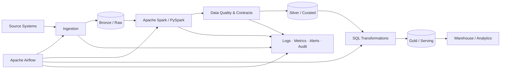

# Enterprise Data Pipelines

A portfolio repository for **enterprise Data Engineering and Data Platform Architecture**, focused on production-style orchestration, distributed processing, SQL transformation, reusable pipeline patterns, and governed delivery.

> Designed from a **Lead Data & AI Architect** perspective: pipelines are treated as maintainable platform products with contracts, validation, observability, security, and operational ownership—not isolated ETL scripts.

## Architecture



## Engineering principles

- Metadata-driven and reusable pipeline design
- Idempotent and restartable processing
- Explicit data contracts and validation
- Partition-aware Spark processing
- Clear orchestration dependencies and failure handling
- Environment-specific configuration instead of hard-coded runtime values
- Observability across ingestion, transformation, quality, and delivery
- CI validation for pipeline assets
- Security, secrets, and least-privilege access as platform concerns

## Repository structure

```text
enterprise-data-pipelines/
├── .github/       # CI / repository automation
├── dags/          # Apache Airflow orchestration
├── spark_jobs/    # Spark / PySpark processing
├── sql/           # SQL transformation assets
└── README.md
```

## Technology focus

**Python · SQL · Apache Spark · PySpark · Apache Airflow · Snowflake / Cloud Data Warehouse · Lakehouse · PostgreSQL · Data Quality · CI/CD · Kubernetes · GCP-oriented Data Platform Architecture**

## What this repository demonstrates

This project is intended to demonstrate architecture and engineering skills relevant to:

**Lead Data & AI Architect · Data Architect · Principal Data Engineer · Data Platform Architect · Cloud Data Architect · Senior Data Engineer**

Key areas include distributed data processing, workflow orchestration, reusable pipeline engineering, enterprise SQL, quality gates, observability, and production-operability patterns.

## Production-readiness checklist

A production pipeline should make the following explicit:

- Source and target contracts
- Incremental/watermark strategy
- Partitioning and parallelism
- Retry and idempotency behavior
- Data-quality expectations
- Schema-evolution policy
- Secrets and identity model
- SLA/SLO and alerting
- Lineage and audit evidence
- Backfill/reprocessing strategy
- Cost and performance measurements

## Roadmap

- Expand representative Airflow DAG patterns
- Add reusable Spark ingestion/transformation templates
- Add data-quality examples and contract validation
- Add architecture decision records (ADRs)
- Add CI checks and test examples
- Add an end-to-end reference pipeline with operational telemetry

---

### Keywords

`Data Engineering` · `Data Architecture` · `Apache Spark` · `PySpark` · `Apache Airflow` · `SQL` · `Snowflake` · `GCP` · `Data Platform` · `ETL` · `ELT` · `Lakehouse` · `Data Quality` · `Data Governance` · `Observability` · `CI/CD` · `Enterprise Architecture`